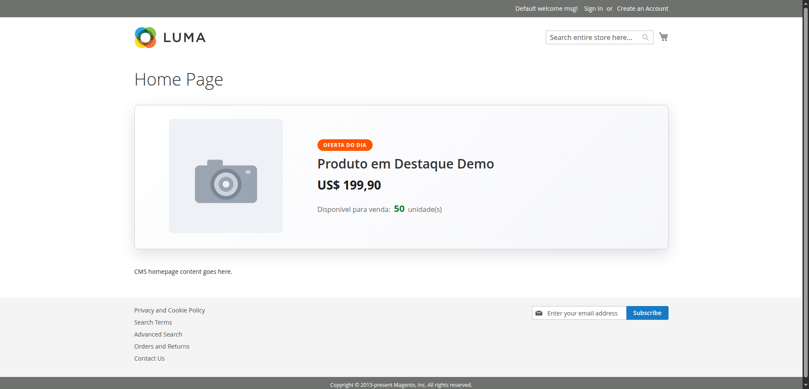
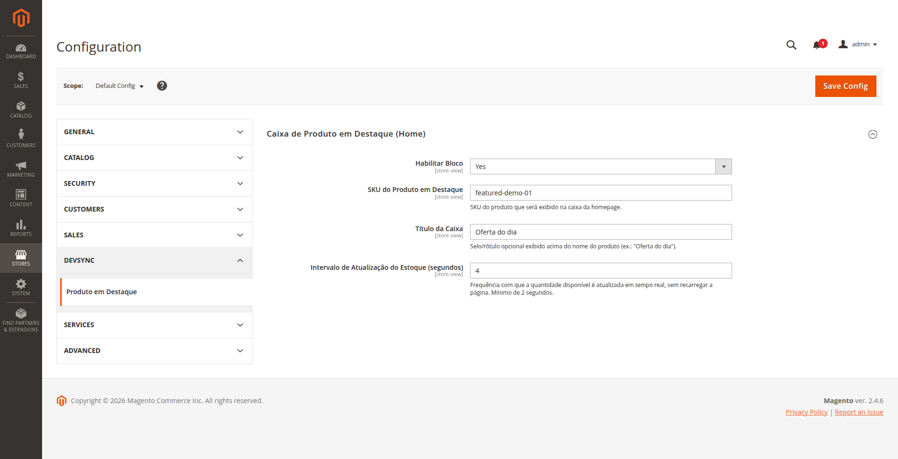

# Devsync_FeaturedProduct

Módulo para **Magento 2.4.6 Open Source (tema Luma)** que exibe, como **primeiro
elemento do conteúdo principal da homepage** (logo abaixo do cabeçalho/menu e
ocupando toda a largura do `content`), uma **caixa de produto em destaque** com
**título, preço, imagem base e quantidade disponível para venda** — sendo a
**quantidade atualizada em tempo real**, sem recarregar a página. Ao clicar na
caixa, o usuário é levado à página do produto.

> Nenhuma alteração é feita no tema. Todo o comportamento vive dentro da pasta do
> módulo (`app/code/Devsync/FeaturedProduct`).

## A caixa na homepage (tema Luma)



A caixa é renderizada como primeiro elemento do `content main` (o conteúdo padrão
do CMS aparece logo abaixo). O número **"Disponível para venda: 50 unidade(s)"** é
renderizado e atualizado por um componente Knockout; o restante (título, preço,
imagem) é renderizado no servidor.

## Configuração no painel administrativo

**Stores → Configuration → Devsync → Produto em Destaque**



| Campo | Função |
|---|---|
| **Habilitar Bloco** | Mostra ou oculta a caixa na home (`Sim`/`Não`). |
| **SKU do Produto em Destaque** | SKU do produto que aparece na caixa. |
| **Título da Caixa** | Selo/rótulo opcional acima do nome (ex.: "Oferta do dia"). |
| **Intervalo de Atualização do Estoque (segundos)** | Frequência do polling de estoque em tempo real (mínimo 2s). |

A configuração respeita os escopos **default / website / store view**
(`showInDefault/Website/Store`), e todos os textos do módulo são traduzidos pelo
arquivo de tradução `i18n/pt_BR.csv`.

---

## Requisitos atendidos

| Requisito / Desejável | Como foi atendido |
|---|---|
| Elemento na home Luma, 1º do `content`, largura total | `view/frontend/layout/cms_index_index.xml` → `<referenceContainer name="content">` com `before="-"` + CSS full-width |
| Título, preço, imagem base, quantidade | `ViewModel/FeaturedProduct` via `ProductRepositoryInterface`, `Catalog\Helper\Image`, `Pricing\Helper\Data` |
| Clique → página do produto | `<a href>` com `getProductUrl()` |
| **Estoque em tempo real sem reload** | Componente **Knockout** (`uiComponent`) faz *polling* AJAX periódico no endpoint `featuredproduct/stock/index` e atualiza um único `ko.observable` |
| Sem editar o tema | Tudo em `app/code/Devsync/FeaturedProduct` |
| **Reference block/container** *(desejável)* | `referenceContainer name="content"` no layout |
| **Block arguments** *(desejável)* | `<argument name="view_model">` (objeto) e `<argument name="jsLayout">` (array) |
| **jsLayout** *(desejável)* | `Block\FeaturedProduct::getJsLayout()` mescla valores de runtime no esqueleto vindo do XML e injeta em `Magento_Ui/js/core/app` |
| **Knockout** *(desejável)* | `view/frontend/web/js/view/stock.js` + template `stock.html` |
| **Configurações no admin** *(desejável)* | `etc/adminhtml/system.xml` |

---

## Decisões técnicas

Escolhas deliberadas para correção e manutenibilidade em nível enterprise:

- **Seleção por SKU via configuração** (`system.xml`), e **não** por um atributo
  criado no produto. A escolha do produto é responsabilidade de configuração, não
  de dado de catálogo.
- **`ProductRepositoryInterface::get()`** para carregar o produto (service
  contract), e **não** uma collection.
- **Quantidade "disponível para venda" via MSI**
  (`GetProductSalableQtyInterface`), que é o valor correto no 2.4.x (já desconta
  reservas e thresholds) — e **não** a `qty` bruta do produto.
- **Estoque resolvido por SKU + `stockId`** (via `StockResolverInterface` sobre o
  sales channel do website). Não há premissa de que o `stock_item` tenha o mesmo
  id do produto (o que só funcionaria em cenários 1:1).
- **Nenhum observer/plugin global.** O módulo não intercepta respostas de
  controllers nem executa nada nas demais páginas da loja; ele só age na home e no
  seu próprio endpoint.
- **O número do estoque é renderizado exclusivamente pelo componente Knockout**
  (template `stock.html`), nunca "chumbado" no `.phtml`. O `.phtml` só renderiza o
  rótulo e a unidade. Assim o Knockout tem função real: exibir o valor inicial e
  todos os valores subsequentes do polling.
- **Atualização automática de verdade:** o componente registra um `setInterval`
  que consulta o endpoint e atualiza o `observable`; o número muda sozinho, sem
  recarregar a página.

### Padrões de projeto
- **Dependency Injection** por construtor em todas as classes (constructor
  property promotion, `readonly`, `declare(strict_types=1)`).
- **Service Contract**: `Api\StockProviderInterface` desacopla a fonte de estoque;
  a implementação MSI (`Model\SalableQtyProvider`) é vinculada por `preference` no
  `etc/di.xml`. Trocar a fonte de estoque (MSI, ERP, legado) é uma linha de XML,
  sem tocar em nenhum consumidor.
- **View Model** (`ArgumentInterface`): mantém o Block magro e a apresentação
  testável.
- **Config typed accessor** (`Model\Config`): única fonte de verdade para os paths
  do `system.xml`, sem "magic strings" espalhadas.

### Segurança
O endpoint de tempo real **não recebe SKU/ID do cliente**: ele relê o SKU
configurado no servidor. Assim, o endpoint não pode ser usado para enumerar
estoque de produtos arbitrários. A resposta usa `Cache-Control: no-store` para
garantir o valor sempre atual (sem cache de browser/CDN/Varnish). Toda saída no
template é escapada via `Escaper`.

---

## Estrutura

```
Devsync/FeaturedProduct
├── registration.php · composer.json · README.md
├── Api/
│   └── StockProviderInterface.php          # contrato de serviço (estoque)
├── Block/
│   └── FeaturedProduct.php                 # jsLayout dinâmico p/ o Knockout
├── Controller/Stock/
│   └── Index.php                           # GET featuredproduct/stock/index → JSON
├── Model/
│   ├── Config.php                          # acessor tipado do system.xml
│   └── SalableQtyProvider.php              # implementação MSI do contrato
├── ViewModel/
│   └── FeaturedProduct.php                 # dados do produto p/ o template
├── etc/
│   ├── module.xml · acl.xml · config.xml · di.xml
│   ├── adminhtml/system.xml                # painel admin
│   └── frontend/routes.xml                 # rota do endpoint
├── i18n/ (en_US.csv, pt_BR.csv)            # tradução
├── view/frontend/
│   ├── layout/cms_index_index.xml          # referenceContainer + block arguments + jsLayout
│   ├── templates/featured.phtml
│   └── web/
│       ├── css/featured.css
│       ├── js/view/stock.js                # uiComponent Knockout (polling)
│       └── template/stock.html             # binding do valor de estoque
├── Test/
│   ├── Unit/                               # PHPUnit (cobertura 100%)
│   └── Mftf/                               # teste E2E funcional
└── docs/img/                               # imagens do README
```

---

## Como o "tempo real" funciona

1. No primeiro render, o Block injeta no `jsLayout` a URL do endpoint, o intervalo
   e a quantidade inicial (calculada no servidor).
2. O componente `Devsync_FeaturedProduct/js/view/stock` (Knockout `uiComponent`)
   exibe a quantidade inicial e agenda um `setInterval` no intervalo configurado.
3. A cada ciclo, ele faz um `GET` em `featuredproduct/stock/index`, que retorna
   `{"success":true,"qty":N}` com a quantidade vendável atual (MSI).
4. Apenas o `observable` da quantidade é atualizado — somente aquele número
   re-renderiza; a página **não** recarrega.

Para validar: abra a home, altere o estoque do produto no admin (ou gere uma
reserva/pedido) e observe o número de "Disponível para venda" mudar sozinho no
próximo ciclo. Na aba **Network** do navegador aparecem as chamadas periódicas a
`featuredproduct/stock/index`.

---

## Instalação

1. Copie o módulo para `app/code/Devsync/FeaturedProduct` (ou instale via Composer
   com `type: magento2-module`).

2. Habilite e atualize o Magento:
   ```bash
   bin/magento module:enable Devsync_FeaturedProduct
   bin/magento setup:upgrade
   bin/magento setup:di:compile          # em produção
   bin/magento setup:static-content:deploy pt_BR en_US -f   # em produção
   bin/magento cache:flush
   ```

3. Configure em **Stores → Configuration → Devsync → Produto em Destaque**
   (habilitar, SKU, título, intervalo), salve e `bin/magento cache:flush`.

Para exibir os textos em português, use o locale **pt_BR** na loja
(**Stores → Configuration → General → Locale Options → Locale**); as strings são
traduzidas por `i18n/pt_BR.csv`.

---

## Testes

### Unitários (PHPUnit) — cobertura 100%

```bash
bin/magento dev:tests:run unit   # ou:
vendor/bin/phpunit -c dev/tests/unit/phpunit.xml.dist app/code/Devsync/FeaturedProduct/Test/Unit
```

25 casos cobrindo `Config`, `SalableQtyProvider`, `ViewModel`, `Block` e o
`Controller` — **100% de linhas, métodos e classes** (`Classes 5/5`,
`Methods 22/22`, `Lines 101/101`).

### E2E (MFTF)

Um teste funcional (`Test/Mftf/Test/DevsyncFeaturedProductHomepageTest.xml`) cria
um produto, configura-o como destaque e valida: a caixa como primeiro elemento do
content, título/preço/imagem/estoque, o endpoint de estoque respondendo em JSON e
o clique levando à página do produto.

```bash
vendor/bin/mftf generate:tests DevsyncFeaturedProductHomepageTest
vendor/bin/mftf run:test DevsyncFeaturedProductHomepageTest
```
